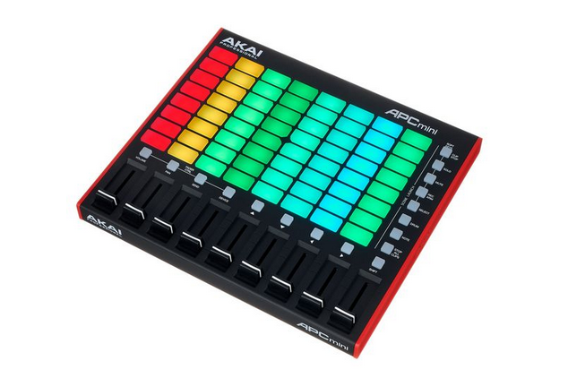
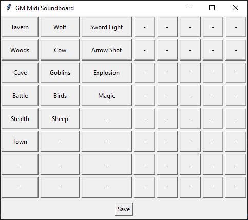
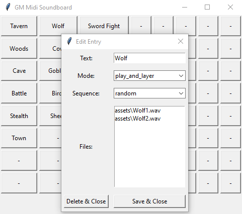

# DM Midi Soundboard

This project came to life because I, as a hobby dungeon master and programmer, was not satisfied with the options to use midi hardware to play sounds during game sessions.
The tools I found which work well with midi devices are targeting music production and are way to complicated for the simple task, I had in mind.

## Midi Device

I created and tested the project with a specific midi controller device. But I had in mind, that it should be easy to adapt the tool to be **working for a lot of other devices** too. To implement this goal, I included a configuration file, which maps the device dependent key code to a position in the key grid. Therefor, by changing this mapping file, other midi devices should work out of the box.

The controller I work with is the AKAI Professional APC mini MK2, which has a 8x8 key matrix with volume control positioned for each column. With this I can setup 64+ sounds to be played. Additionally to the volume control per column, I configured the rightmost slider to work as a master volume and a button on the right side as a global stop command.

### Connecting To The Right Device

## UI - Main Window

The UI is minimalistic designed. You can setup the soundboard by clicking an entry and you can change the position of sounds with drag and drop.

**In the current version, it's not implemented or planed that you can play and sounds with the UI. Only the midi device can trigger a playback.**

### Features & Handling

* The button grid size is configured in the *controller_config.yaml*.
* Create a new sound configuration by clicking on an empty "-" entry.
* Edit an existing sound configuration by clicking on its entry.
* Swap the position of two entries by dragging one of another.
* Mark entries who couldn't load all sound files with a gray background color.
* Save the current setup to a soundboard yaml file.
  * This also saves an html file with the chosen base name to print out the grid view.

## UI - Entry Editor

The entry editor is used to create, edit or delete the sound configuration at a position. 

### Features & Handling

* Set a name to be displayed in the overview and in the print out.
* Set the [play mode](#sound-play-modes) and the [sequence](#sound-file-sequence).
* Edit the sound files:
  * **Add** new sounds by drag and drop files from your file manager / file explorer into the listbox.
  * **Delete** sounds from the list by selecting them and hitting the <u>Del</u>ete key.
  * **Rearrange** the file list by selecting one or multiple entries to move and hitting the <u>Up</u> arrow or <u>Down</u> arrow key.
* Close the window via the X in the top right corner to discard all changes.

## Sound Play Modes

The tool supports three different modes to play sound files. 

**Play And Layer**

* Every key hit on this entry triggers a playback of the sound. 
* If a sound is playing while the key is hit again, the two sounds are played overlapping.
* The only way to stop sounds playing in this mode is the global stop key.
* After the current sound is finished, no new sound is played.
* Best suited for short sound effects.

<u>Color:</u> While any sound is playing, the key is colored red.

**Play And Stop**

* The behavior of this key depends on the current state. 
  * If no sound is playing, the next sound file is played.
  * If a sound is currently playing, the current one is stopped.
* After the current sound is finished, the next sound is played.
* Best suited for atmospheric background music.

<u>Color:</u> While any sound is playing, the key is colored green.

**Play And Pause**

* The behavior of this key depends on the current state. 
  * If no sound is playing, the next sound file is played.
  * If a sound is currently playing, the current one is paused.
  * If a sound is currently paused, it is continued.
* After the current sound is finished, the next sound is played.
* The only way to stop sounds playing in this mode is the global stop key.
* <u>Every paused sound blocks one of the limited virtual audio channels from pygame. The number of available channels depends on your platform.</u>

<u>Color:</u> 

* While any sound is playing, the key is colored blue.
* While any sound is paused, the key is colored blue with reduced brightness.

## Sound File Sequence

The tool supports two different sequence modes. They manage, which sound file should be played next.

**Sequence**

The next sound to play is the next file in the list of files after the current one.

**Random**

The next sound to play is selected at random from the list of files. It could be the current one again.

## Colored Keys

To display a feedback about the state of sounds playing, the corresponding keys are colored depending on the state and mode of the sound entry.

If you use a device which is not compatible with the control codes of the AKAI Professional APC mini MK2, you can disable this feature by selecting an invalid id for the output device. see [Connecting To The Right Device](#connecting-to-the-right-device)